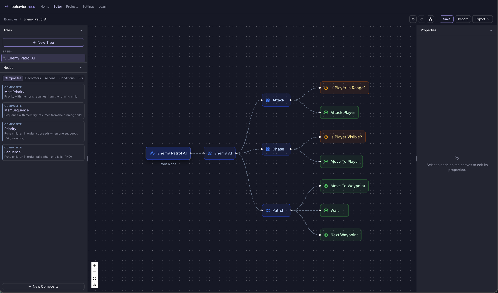

# Behavior Trees Editor



A free, open-source visual editor for behavior trees, live at [behaviortrees.com](https://www.behaviortrees.com). Model AI for games, robotics, and simulations, then export to an open JSON format you can load with any [behavior3](http://behavior3.com)-compatible library.

Originally based on [behavior3editor](https://github.com/behavior3/behavior3editor) by Renato de Pontes Pereira, since restyled onto the Nocturne design system and extended with a guides site and a next-generation React editor.

## What's in this repo

| Path | What it is | Where it deploys |
|------|------------|------------------|
| `src/` | Classic editor (AngularJS + gulp) | [behaviortrees.com](https://www.behaviortrees.com) |
| `site/` | Guides and articles (Astro) | [behaviortrees.com/learn](https://www.behaviortrees.com/learn/) |
| `behavior-tree-editor/` | Next-gen editor (React + TypeScript + React Flow) | [new.behaviortrees.com](https://new.behaviortrees.com) |

## Features

- **Custom nodes**: create your own node types in any of the four basic categories — *composite*, *decorator*, *action*, or *condition*
- **Node properties**: edit titles, descriptions, and custom properties per node instance
- **Manual and auto layout**: drag nodes around, or press `a` to auto-organize the whole tree
- **Multiple trees per project**: create and manage as many trees as you need
- **JSON import/export**: an open format that works with any behavior3-compatible runtime
- **No lock-in**: runs in the browser, no accounts, no external tools or engines required

## Development

### Classic editor

```sh
git clone https://github.com/behaviortrees/behaviortrees.git
cd behaviortrees
npm install
npx bower install
gulp serve    # live reload at http://127.0.0.1:8000
gulp build    # production build
```

### Guides site

```sh
cd site
npm install
npm run dev
```

### React editor

```sh
cd behavior-tree-editor
pnpm install
pnpm dev
```

## Deployment

`build-deploy.sh` builds the classic editor and the guides site, merging both into `deploy/` as the complete behaviortrees.com static site (Netlify runs this via `netlify.toml`). The React editor deploys independently through its own `vercel.json`.

## License

- The classic editor and repo root are **MIT** — see [LICENSE](LICENSE), © 2014 Renato de Pontes Pereira.
- The React editor (`behavior-tree-editor/`) is **AGPL-3.0** © Alan Hoskins, with portions derived from the MIT original — see [behavior-tree-editor/LICENSE](behavior-tree-editor/LICENSE) and [behavior-tree-editor/LICENSE-MIT](behavior-tree-editor/LICENSE-MIT).

Credit to the original [behavior3](https://github.com/behavior3) team for the editor this project grew from.
